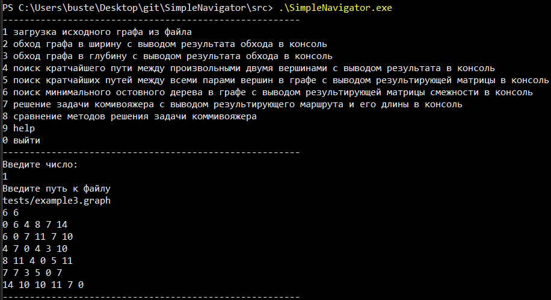
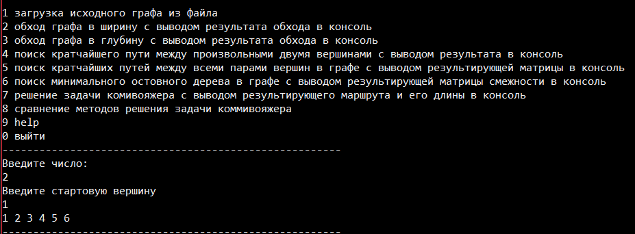
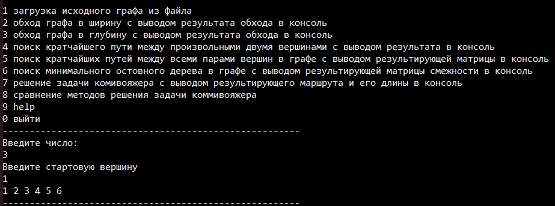
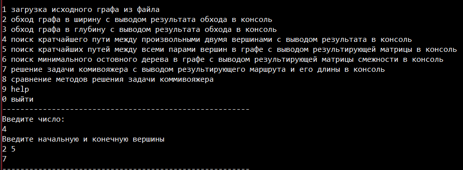
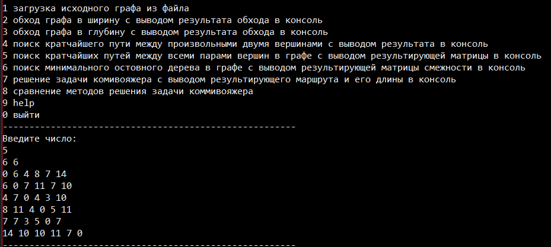
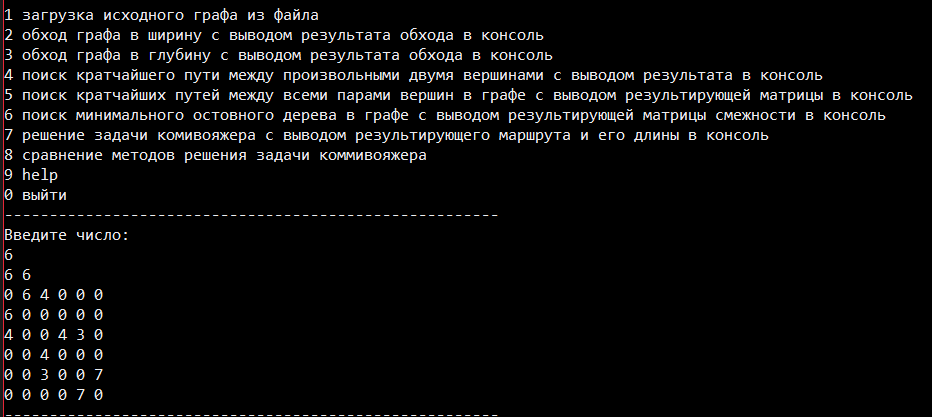
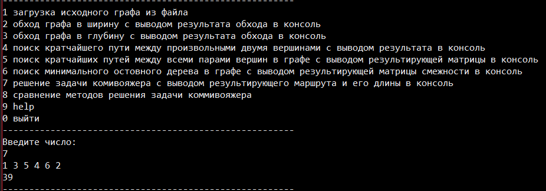
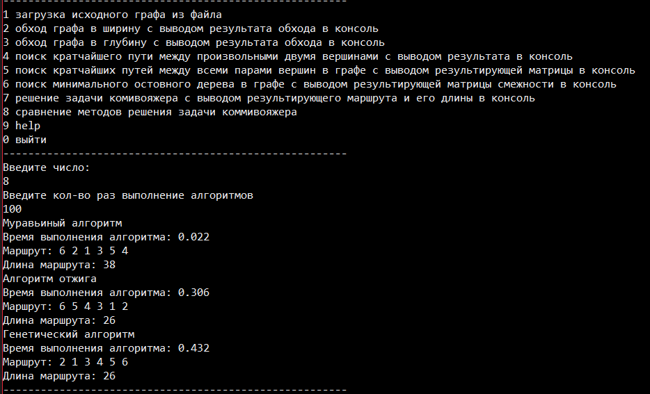

# SimpleNavigator

В данном проекте реализованы несколько основных алгоритмов на графах. 
Для работы с алгоритмами реализован консольный интерфейс. 

+   Обход графа в ширину
+   Обход графа в глубину
+   Поиск кратчайшего пути между произвольными двумя вершинами(алгоритм Дейкстры)
+   Поиск кратчайших путей между всеми парами вершин в графе(алгоритм Флойда-Уоршелла)
+   Поиск минимального остовного дерева в графе(алгоритм Прима)
+   Решение задачи комивояжера
+   +   Муравьиный алгоритм
+   +   Алгоритм отжига
+   +   Генетический алгоритм

 

